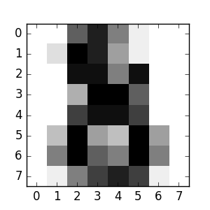

# Introduction to Machine Learning, with Application in Scikit-Learn

*Paul Paczuski [pavopax.com](http://pavopax.github.io)*

*Instructions: This is a Jupyter Notebook. If opened with "Launch Binder" (or running on your local machine), then use `shift-Enter` to run the code cells and see the output.*

## How can we use a *machine* to *learn* to solve a task (recognize handwritten digits)?



*The above is a handwritten digit, converted to a computer-readable format. Which digit do you think this is?*

In this machine learning demo, our objective is:
* Given images of handwritten digits, ask the machine to tell us what digits are shown

The steps in the process:
* Read in the raw data
* Learn the pattern (**fit a model**) using a bunch of known digit images and their labels (**training data**)
* Use the learned pattern on new data, to determine what digits are shown (**predict**)

We can perform this task with just a few lines of Python scikit-learn code.

## Read in the Raw Data


```python
# set-up and load data
from sklearn import datasets

digits = datasets.load_digits()

print digits.DESCR
```

    Optical Recognition of Handwritten Digits Data Set
    ===================================================
    
    Notes
    -----
    Data Set Characteristics:
        :Number of Instances: 5620
        :Number of Attributes: 64
        :Attribute Information: 8x8 image of integer pixels in the range 0..16.
        :Missing Attribute Values: None
        :Creator: E. Alpaydin (alpaydin '@' boun.edu.tr)
        :Date: July; 1998
    
    This is a copy of the test set of the UCI ML hand-written digits datasets
    http://archive.ics.uci.edu/ml/datasets/Optical+Recognition+of+Handwritten+Digits
    
    The data set contains images of hand-written digits: 10 classes where
    each class refers to a digit.
    
    Preprocessing programs made available by NIST were used to extract
    normalized bitmaps of handwritten digits from a preprinted form. From a
    total of 43 people, 30 contributed to the training set and different 13
    to the test set. 32x32 bitmaps are divided into nonoverlapping blocks of
    4x4 and the number of on pixels are counted in each block. This generates
    an input matrix of 8x8 where each element is an integer in the range
    0..16. This reduces dimensionality and gives invariance to small
    distortions.
    
    For info on NIST preprocessing routines, see M. D. Garris, J. L. Blue, G.
    T. Candela, D. L. Dimmick, J. Geist, P. J. Grother, S. A. Janet, and C.
    L. Wilson, NIST Form-Based Handprint Recognition System, NISTIR 5469,
    1994.
    
    References
    ----------
      - C. Kaynak (1995) Methods of Combining Multiple Classifiers and Their
        Applications to Handwritten Digit Recognition, MSc Thesis, Institute of
        Graduate Studies in Science and Engineering, Bogazici University.
      - E. Alpaydin, C. Kaynak (1998) Cascading Classifiers, Kybernetika.
      - Ken Tang and Ponnuthurai N. Suganthan and Xi Yao and A. Kai Qin.
        Linear dimensionalityreduction using relevance weighted LDA. School of
        Electrical and Electronic Engineering Nanyang Technological University.
        2005.
      - Claudio Gentile. A New Approximate Maximal Margin Classification
        Algorithm. NIPS. 2000.
    


```python
# we have 1797 examples, each consisting of a matrix of 64 elements
digits.data.shape
```


    (1797, 64)


```python
# here is one random "image"
digits.data[100]
```


    array([  0.,   0.,   0.,   2.,  13.,   0.,   0.,   0.,   0.,   0.,   0.,
             8.,  15.,   0.,   0.,   0.,   0.,   0.,   5.,  16.,   5.,   2.,
             0.,   0.,   0.,   0.,  15.,  12.,   1.,  16.,   4.,   0.,   0.,
             4.,  16.,   2.,   9.,  16.,   8.,   0.,   0.,   0.,  10.,  14.,
            16.,  16.,   4.,   0.,   0.,   0.,   0.,   0.,  13.,   8.,   0.,
             0.,   0.,   0.,   0.,   0.,  13.,   6.,   0.,   0.])


```python
# ... it is labeled as the digit "4"
digits.target[100]
```


    4


```python
# "target" is ML speak for outcome (y)
# our target is the digit labels 0-9
digits.target
```

    [0 1 2 ..., 8 9 8]


```python
len(digits.target)
```

    1797


## Fit the Model 
This is the "learn" part (Machine *Learning*).

We'll use a machine learning algorithm to find the patterns in this data ("fit the model").

We want to learn this relationship:

    Given a matrix of numbers -> which digit is it?


```python
# let's pull out some black box algorithm to do the "learning"
from sklearn import svm

classifier = svm.SVC(gamma=0.001, C=100.)
```


```python
# now, FIT the model (learn the pattern of the data)
# (this .fit method "changes" the object "classifier")
classifier.fit(digits.data[:-1], digits.target[:-1])  
```


    SVC(C=100.0, cache_size=200, class_weight=None, coef0=0.0,
      decision_function_shape=None, degree=3, gamma=0.001, kernel='rbf',
      max_iter=-1, probability=False, random_state=None, shrinking=True,
      tol=0.001, verbose=False)


## Use the Model for Prediction

Now we can predict new values.

In particular, we can ask our classifier (algorithm) what is the digit of our last image in the digits dataset ("-1" means last - ignore the semicolon), which we have not used to train the classifier:


```python
digits.data[-1:]
```

    [[  0.   0.  10.  14.   8.   1.   0.   0.   0.   2.  16.  14.   6.   1.
        0.   0.   0.   0.  15.  15.   8.  15.   0.   0.   0.   0.   5.  16.
       16.  10.   0.   0.   0.   0.  12.  15.  15.  12.   0.   0.   0.   4.
       16.   6.   4.  16.   6.   0.   0.   8.  16.  10.   8.  16.   8.   0.
        0.   1.   8.  12.  14.  12.   1.   0.]]


```python
# the algorithm's answer (prediction) is...
classifier.predict(digits.data[-1:])[0]
```


    8


What do you think?

## Summary 

Here are the key steps in this process:

1. Read in the data
2. **Fit** the model using some algorithms
3.  Use the model to **predict** on new data

# Two Types of Machine Learning

Below are the main types of machine learning, as well as some example algorithms.

## Supervised Learning
- When the target/outcome/y is known
- There are two classes of models, depending on the type of the target:
    - classification: when outcome is categorical
    - regression: when outcome is continuous
- **Example algorithms**: linear regression, logistic regression, support vector machine, random forest, k-nearest neighbors

## Unsupervised Learning
- When the target/outcome/y is unknown (we want to find "clusters" in the data)
- There are two main uses of unsupervised learning:
  - clustering
  - dimension reduction
- **Example algorithms**: k-means clustering, affinity propagation clustering, principal component analysis

# Resources

## Essential quick-starts

[Machine learning introduction/tutorial (with scikit-learn code)](http://scikit-learn.org/stable/tutorial/basic/tutorial.html)

[Python - "immediately useful tools"](http://python.net/~goodger/projects/pycon/2007/idiomatic/handout.html)

[10 minutes to Pandas](http://pandas.pydata.org/pandas-docs/stable/10min.html)

[Pandas cookbook](http://pandas.pydata.org/pandas-docs/stable/cookbook.html)

[Pandas cheat sheet](blog.quandl.com/cheat-sheet-for-data-analysis-in-python)


## More Tutorials

[Supervised learning introduction (with scikit-learn code)](http://scikit-learn.org/stable/tutorial/statistical_inference/supervised_learning.html)

[Unsupervised learning introduction (with scikit-learn code)](http://scikit-learn.org/stable/tutorial/statistical_inference/unsupervised_learning.html)

## References

A great textbook to learn more - highly recommended:

* [[free pdf!] An Introduction to Statistical Learning with Applications in R](http://www-bcf.usc.edu/~gareth/ISL/)

This is the Canonical Textbook on Machine Learning, by the same authors, but it is older than the above book and is more technical

* [[free pdf!] The Elements of Statistical Learning: Data Mining, Inference, and Prediction](http://statweb.stanford.edu/~tibs/ElemStatLearn/)


[scikit-learn tutorials](http://scikit-learn.org/stable/tutorial/index.html)

[scikit-learn user guide](http://scikit-learn.org/stable/user_guide.html)

[Choosing the right estimator](http://scikit-learn.org/stable/tutorial/machine_learning_map/index.html)

[scikit-learn - documentation](http://scikit-learn.org/stable/documentation.html)


# Acknowledgments

The source of the scikit-learn demo:
* http://scikit-learn.org/stable/tutorial/basic/tutorial.html
